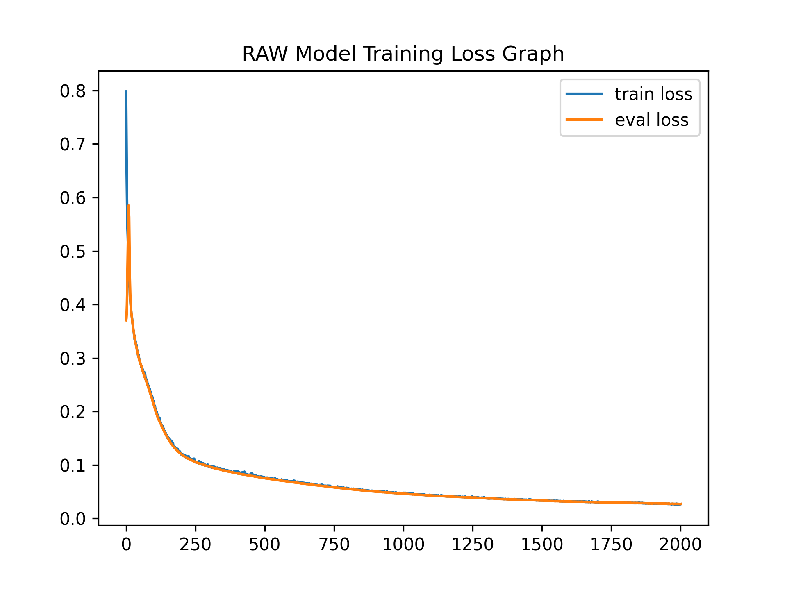

# Environment

To create visualized results and use ssim metric, I used several libraries. Please make sure you installed all the needed libraries given in the `requirements.txt` file into your environment.

# Dataset

I created a dataset, but it was too large to upload to GitHub. Please run the `homework1.py`. It will create a directory named `dataset` and will create 10 files for each data type. Please do not make any changes on the dataset creation step, because all the subsequent tasks makes assumptions on the data file structures. It is needed to have 10 files for each datatype in `dataset` directory and it will be used in the `Loader` class implemented in the `utility.py` file.

The `Loader` partitions the dataset into `train`, `eval`, and `test` portions. `train` part is the %80 of the dataset and the `eval` and `test` datasets include 10% of the dataset each.

# Tasks

### Part 1 (MLP):

I created a very basic MLP structure with only 3 linear layers. The model only takes the action index and makes a prediction about the final positions of the initial object. In the training phase, the `train` and `eval` portions of the dataset given to the model. In each step, the MSE loss value is calculated for each datasets. But, only the `train` portion is used in the backpropagation step. As it is seen from the below graph, the model successfully converges. The `train()` function saves model after each epoch and the evaluated loss values are used to get the best model. The script compares the `eval` dataset loss values and takes the model instance where it has the minimum loss value and saves it as the `hw1_1.pt` PyTorch file.

The `test()` script loads the best model and calculates the loss value considering only the `test` dataset. For the trained MLP model, the test loss is `0.004744` which is very similar that we encounter in the training phase meaning that the model successfully learned the properties given in the training dataset. The below graph shows the visual comparison of the actual environments' final image and the predicted image. I overwrite the given simulation environment class so that when I put the predicted position of the object, it puts a blue cube on the predicted position and takes the picture of the environment. It enabled to visually compare the actual positions and the predicted positions of the object.  

As it is seen from the image, the model creates only 4 distinct position predictions according to the action id. Because the model only takes the action id, it is reasonable getting such results. It can not consider the objects' shape and size. 

#### Experiment
To run the mlp model it is enough to type `python hw1_1.py` into terminal. The main function, firstly, trains the model and tests the best model performance. Because the model size is very small, it is not recommended to decrease the epoch count but you can experiment with the other parameters of the functions like the learning rate and the example count.

### Part 2 (CNN):
Again, the loss values for the `train` and `eval` datasets can be seen from the below graph. The training, evaluation, and testing steps are very similar with the MLP model. But, in this model, I used CNN architecture to capture the information from the states' initial visuals. The model makes prediction of the objects' final position. After the CNN layers, I inserted the action id as a one hot vector to the flattened vector and applied linear layers.  

The tested loss value is 0.004157. Again, it is very similar to the loss values calculated in the training phase. Below visual shows the predicted and real positions of the objects. As it is seen, now the model can capture the characteristics of the given object in addition to the action id. So, it makes slightly different final position predictions according to the given information. It is seen that the performance of the model increased.

#### Experiment
Again, you can run `python hw1_2.py` in the terminal to run the train and test scripts to run. Even though it is not suggested to change the epoch count, all given experiment parameters can be changed to evaluate different experimental results.  

### Part 3 (RAW, U-NET):

Because of the size limits of the GitHub, I couldn't upload the trained model parameters. Please download the trained version from ... here [] and save to this project directory with the name of `hw1_3.pt` to make the tests.

This model takes the raw image inputs of the environments' final state and uses action id to create an image predicting the states' visual interpretation. This model uses Convolution and Deconvolution layers with Residual Connections. It converts the action id into 4 channel on hot encoding and uses this information to encode the image with it. After encoding, it flattens the encoded value and inserts the action id as a one hot encoding again. After deconvolution layers, it produces the predicted image. As it is seen from the loss graph, again it converges. But, I needed to train this model for 2000 epochs to get better results. I used SSIM as the loss function.  

The loss value is ... As it is seen from the output images, the model is very successful in inference time. The predicted results are very similar to the real values. Also, it successfully changes the structure of the seen arm. 

#### Experiment
Even though you can run experiments with `python hw1_3.py` line, it is not recommended to run for 2000 epochs. To get basic results, you can decrease this value. Also, you should change the `eval_epoch_step` parameter according to it. Because, this parameter controls the interval needed to compare the current model `eval` result with the previous ones. It should divide the epoch count and be integer.